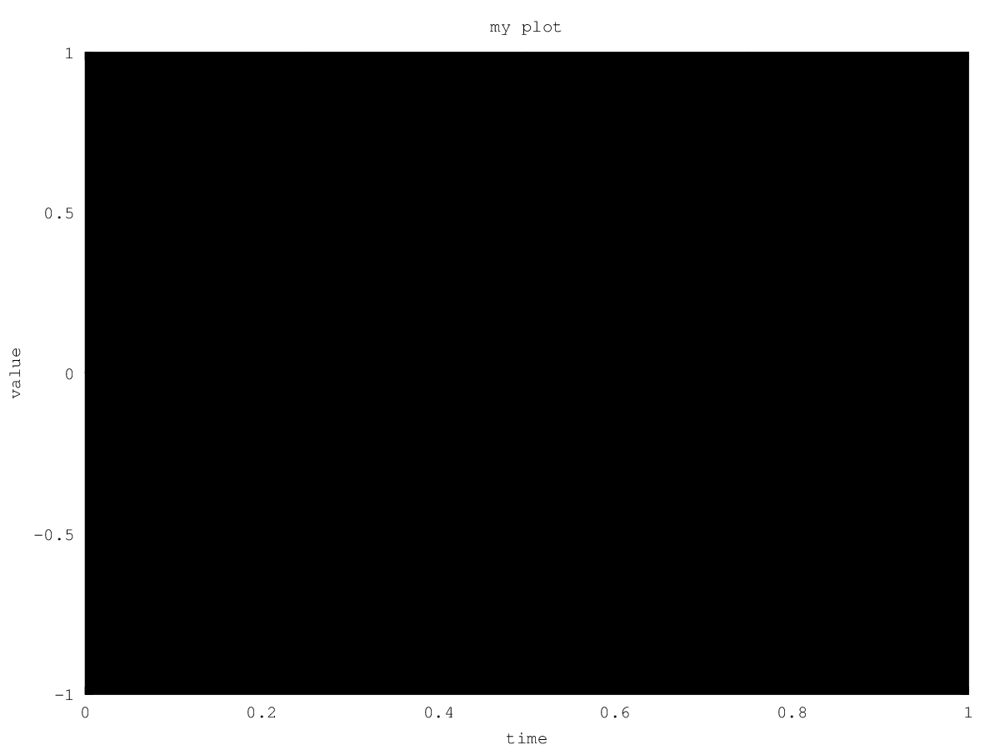

Week 2
======

- Linear Regression with Multiple Variables
    - Multivariate Linear Regression
        - Multiple Features
        - Gradient Descent for Multiple Variables
        - Gradient Descent in Practice I - Feature Scaling
        - Gradient Descent in Practice II - Learning Rate
        - Features and Polynomial Regression
    - Computing Parameters Analytically
        - Normal Equation
    - Review
        - Quiz: Linear Regression with Multiple Variables
        - Assignment: Linear Regression
- Octave Tutorial
    - Octave Tutorial
        - Basic Operations
        - Moving Data Around
        - Computing on Data
        - Plotting Data
        - Control Statements: for, while, if statement
        - Vectorization
        - Normal Equation Noninvertibility
    - Submitting Programming Assignments
        - Working on and Submitting Programming Assignments
    - Review
        - Quiz: Octave Tutorial

--------------------------------------------------------------------------------

Linear Regression with Multiple Variables
=========================================

- Multivariate Linear Regression
    - Multiple Features
    - Gradient Descent for Multiple Variables
    - Gradient Descent in Practice I - Feature Scaling
    - Gradient Descent in Practice II - Learning Rate
    - Features and Polynomial Regression
- Computing Parameters Analytically
    - Normal Equation
- Review
    - Quiz: Linear Regression with Multiple Variables

\[Multivariate Linear Regression] Multiple Features
---------------------------------------------------

TODO: TBA

\[Multivariate Linear Regression] Gradient Descent for Multiple Variables
-------------------------------------------------------------------------

TODO: TBA

\[Multivariate Linear Regression] Gradient Descent in Practice I - Feature Scaling
----------------------------------------------------------------------------------

TODO: TBA

\[Multivariate Linear Regression] Gradient Descent in Practice II - Learning Rate
---------------------------------------------------------------------------------

TODO: TBA

\[Multivariate Linear Regression] Features and Polynomial Regression
--------------------------------------------------------------------

TODO: TBA

\[Computing Parameters Analytically] Normal Equation
----------------------------------------------------

TODO: TBA

\[Review] Quiz: Linear Regression with Multiple Variables
---------------------------------------------------------

TODO: TBA

\[Review] Assignment: Linear Regression
---------------------------------------

I jotted down about a few things I came across while doing this assignment.

Note that there is no answer introduced in this section.

### 1.1 Submitting Solutions

TODO: Edit this section later (maybe)

Coursera offers a unique method of submitting assignments for this course.
In short, the submission and assessment of any assignments in this course are fully automated just by running a given script which can work on Octave/MATLAB. This script prompts you for your login email address and submission token from the assignment page and once you enter them, your answer files are immediately assessed and submitted to the Coursera servers.

This is my first (proper) Coursera course so I am not sure if any other Coursera courses offer such a submission method. Maybe some other programming oriented courses might also employ this sort of submission method, or perhaps because this course is supervised by Professor Andrew Ng who is a Co-founder of Coursera, so that some cool tricks are experimented.

### Submission failed

I encountered the following error when submitting the first assignment:

```octave
% Inside the Octave command line
>> submit
!! Submission failed: unexpected error: urlread: HTTP response code said error
!! Please try again later.
```

#### Solution 1

I encountered this error only a few hours before the deadline at **23:59 December 13, 2015**.
I thought I was done with no marks because I had thought I would have needed to spend much time to resolve this issue.

Many thanks to Jacob Middag who shared the [solution](https://learner.coursera.help/hc/en-us/community/posts/204693179-linear-regression-submit-error?sort_by=votes) for this issue. According to him, the conversion from ASCII to the hexadecimal escape JSONLab uses is not working properly anymore in Octave 4.0.0.

To work around the issue, you need to replace:

```octave
str=sprintf('x0x%X_%s',char(str(1)),str(2:end));
```

by

```octave
str=sprintf('x0x%X_%s',toascii(str(1)),str(2:end));
```

, and

```octave
str=[str str0(pos0(i)+1:pos(i)-1) sprintf('_0x%X_',str0(pos(i)))];
```

by

```octave
str=[str str0(pos0(i)+1:pos(i)-1) sprintf('_0x%X_',toascii(str0(pos(i))))];
```

in both the `lib/makeValidFieldName.m` and `lib/jsonlab/loadjson.m` files.

#### Solution 2 (Update: 11 January 2016)

I found that there is another way to fix this issue above. A mentor from the Machine Learning course introduces a patch to fix the issue in the [course forum](https://www.coursera.org/learn/machine-learning/discussions/vgCyrQoMEeWv5yIAC00Eog).

Briefly speaking, to fix the issue, you need to install this [\<patch>](https://drive.google.com/file/d/0B6lXyE7fgSlXZjlqQ3FIRExmTDA/view) and replace some of the original files inside `machine-learning-ex?/ex?/lib` with the files inside the given patch directory. You need to take this step for every assignment if you are using Octave 4.0.0.

According to the course forum, this will be fixed in Octave 4.0.1. -> TODO: Why they can make this statement? Find out why if any reasons.

This patch directory, `ML_Octave_400_patch/` contains the following files:

```
$ tree ML_Octave_400_patch
ML_Octave_400_patch
├── lib/
│   ├── jsonlab/
│   │   └── loadjson.m*
│   ├── makeValidFieldName.m*
│   └── xxNumToHexStr.m*
└── readme.txt*

2 directories, 4 files
```

The instruction is given in `readme.txt`:

```text
This patch works around the defective printf() function in Octave 4.0.0

Instructions:

1) Extract the contents of this zip file to the "machine-learning-ex?/ex?/" folder
for each programming exercise.  Be sure you preserve the folder attributes and the
other files in that subfolder.

This patch will overwrite these two existing files:
  lib/makeValidFieldName.m
  lib/jsonlab/loadjson.m
It will add the following new file:
  lib/xxNumToHexStr.m

2) Restart Octave or MATLAB after installing the patch.
```

In Mac OS X, you can simply copy-drag (Option⌥ + Drag) and drop the `ML_Octave_400_patch/lib/` directory into the `machine-learning-ex?/ex?/` directory, but ensure that you select <u>***Merge*** instead of Replace</u> so as to preserve the other files in the `machine-learning-ex?/ex?/lib/` directory.


Note that this patch does exactly what the code modification in the [solution](https://learner.coursera.help/hc/en-us/community/posts/204693179-linear-regression-submit-error?sort_by=votes) above fixes, but in a slightly different manner. See the detailed explanation in each hyperlink above.

### 2.4 Visualizing J(θ)

Assuming that you have your correct answer for the cost function `J(θ)` from 2.2.3, the objective for this section 2.4 is for you to be able to understand how to generate a surface graph and a contour graph of a cost function J(θ) – as you may have read the both instruction and code in `ex1.m`, everything you need to generate the graphs is already given (except for your answer for the cost function `J(θ)`, which you need to work out).

That said, when doing this section, I could not obtain either graphs. Every time I ran `ex1.m`, I saw a new figure window entitled with **Figure 2** popped up but soon the program terminated and graphs windows disappeared accordingly before any plotting happened.

The Assignment instruction suggested that there was no need to modify `ex1.m` (and `ex1_multi.m`), as you see below:

> Throughout the exercise, you will be using the scripts `ex1.m` and `ex1 multi.m`. These scripts set up the dataset for the problems and make calls to functions that you will write. <u>You do not need to modify either of them.</u> You are only required to modify functions in other files, by following the instructions in this assignment.

I could not see any error messages when running the code and was wondering what was going on for a little while.
But I figured out one simple solution by inserting one-liner of an Octave command at the end of the code in `ex1.m` to prevent the termination of executing `ex1.m`, which is as simple as this below:

```octave
[...]
% Because of the way meshgrids work in the surf command, we need to
% transpose J_vals before calling surf, or else the axes will be flipped
J_vals = J_vals';
% Surface plot
figure;
surf(theta0_vals, theta1_vals, J_vals)
xlabel('\theta_0'); ylabel('\theta_1');

% Contour plot
figure;
% Plot J_vals as 15 contours spaced logarithmically between 0.01 and 100
contour(theta0_vals, theta1_vals, J_vals, logspace(-2, 3, 20))
xlabel('\theta_0'); ylabel('\theta_1');
hold on;
plot(theta(1), theta(2), 'rx', 'MarkerSize', 10, 'LineWidth', 2);

%%% THE END OF THE GIVEN CODE %%%

% This is the added one line, the program pauses with this line and
% allows you to see the Surface graph and Contour graph of
% the cost function J(θ).
pause;
```

The problem of this was the execution of `ex1.m` terminates as soon as the graphs were generated before them being able to be observed.
So just to prevent this, I simply insert `pause;` soon after the `surf` and `contour` functions being called;
here are the successfully generated graphs:


--------------------------------------------------------------------------------

Octave Tutorial
===============

- Octave Tutorial
    - Basic Operations
    - Moving Data Around
    - Computing on Data
    - Plotting Data
    - Control Statements: for, while, if statement
    - Vectorization
    - Normal Equation Noninvertibility
- Submitting Programming Assignments
    - Working on and Submitting Programming Assignments
- Review
    - Quiz: Octave Tutorial

\[Octave Tutorial]
---------------

\[Octave Tutorial] Basic Operations
-----------------------------------

### Launch Octave by typing `octave`

```sh
$ octave
GNU Octave, version 4.0.0
Copyright (C) 2015 John W. Eaton and others.
This is free software; see the source code for copying conditions.
There is ABSOLUTELY NO WARRANTY; not even for MERCHANTABILITY or
FITNESS FOR A PARTICULAR PURPOSE.  For details, type 'warranty'.

Octave was configured for "x86_64-apple-darwin15.0.0".

Additional information about Octave is available at http://www.octave.org.

Please contribute if you find this software useful.
For more information, visit http://www.octave.org/get-involved.html

Read http://www.octave.org/bugs.html to learn how to submit bug reports.
For information about changes from previous versions, type 'news'.

octave:1> 5+6
```

### Basic arithmetic operators: `+`, `-`, `*`, `/`, `^`

```sh
octave:1> 5+6
ans =  11
octave:2> 3-2
ans =  1
octave:3> 5*8
ans =  40
octave:4> 1/2
ans =  0.50000
octave:5> 2^6
ans =  64
```

### Logical operators: `==`, `~=`, `&&`, `||`, `xor(A,B)`

`1` indicates true, `2` indicates false

```sh
octave:6> 1 == 2    % false
ans = 0
octave:7> 1 ~= 2    % true, not `!=` used in other programming languages
ans =  1
octave:8> 1 && 0    % AND
ans = 0
octave:9> 1 || 0    % OR
ans =  1
octave:10> xor(1,0) % XOR, exclusive or
ans =  1
```

### Prompt profile can be changed by `PS1('>> ')`, pick your style in `''`

```sh
octave:11> PS1('>> ');
>>
>>
```

### Assigning values in variables

```sh
>> a = 3
a =  3
>> a = 3;           % semicolon suppressing output
>> a=3
a =  3
>> a=3;
>> b = 'hi';
>> b
b = hi
>> c = (3>=1);
>> c
c =  1
```

### Display a value and print formatting

```sh
>> a=pi;
>> a
a =  3.1416
>> disp(a);
 3.1416
>> disp(sprintf('2 decimals: %0.2f', a))
2 decimals: 3.14
>> disp(sprintf('6 decimals: %0.6f', a))
6 decimals: 3.141593
>> a
a =  3.1416
>> format long
>> a
a =  3.14159265358979
>> format short
>> a
a =  3.1416
```

### Assigning values to a Matrix

```sh
>> A = [1 2; 3 4; 5 6]
A =

   1   2
   3   4
   5   6

>> A = [1 2;
> 3 4;
> 5 6]
A =

   1   2
   3   4
   5   6

>> v = [1 2 3]
v =

   1   2   3

>> v = [1; 2; 3;]
v =

   1
   2
   3

>> v = 1:0.1:2
v =

 Columns 1 through 7:

    1.0000    1.1000    1.2000    1.3000    1.4000    1.5000    1.6000

 Columns 8 through 11:

    1.7000    1.8000    1.9000    2.0000

>> v = 1:6
v =

   1   2   3   4   5   6

>> ones(2,3)
ans =

   1   1   1
   1   1   1

>> C = 2*ones(2,3)
C =

   2   2   2
   2   2   2

>> C = [2 2 2; 2 2 2]
C =

   2   2   2
   2   2   2

>> w = ones(1,3)
w =

   1   1   1

>> w = zeros(1,3)
w =

   0   0   0

>> w = rand(1,3)
w =

   0.92298   0.45152   0.38449

>> w = rand(3,3)
w =

   0.254998   0.602767   0.964442
   0.956797   0.062504   0.885942
   0.441748   0.175175   0.631338

>> w = rand(3,3)
w =

   0.350853   0.848208   0.040288
   0.445533   0.884052   0.840742
   0.214455   0.123800   0.294939

>> w = randn(1,3)
w =

   0.598468  -0.077019  -2.597472

>> w = randn(1,3)
w =

  -0.80322   0.59338   1.68643
```

### Plotting a graph

```sh
>> w = -6 + sqrt(10)*(randn(1,10000))
>> hist(w)
>> hist(w,50)
```


### Some other useful functions

```sh
>> eye(4)
ans =

Diagonal Matrix

   1   0   0   0
   0   1   0   0
   0   0   1   0
   0   0   0   1

>> I = eye(4)
I =

Diagonal Matrix

   1   0   0   0
   0   1   0   0
   0   0   1   0
   0   0   0   1

>> I = eye(6)
I =

Diagonal Matrix

   1   0   0   0   0   0
   0   1   0   0   0   0
   0   0   1   0   0   0
   0   0   0   1   0   0
   0   0   0   0   1   0
   0   0   0   0   0   1

>> I = eye(3)
I =

Diagonal Matrix

   1   0   0
   0   1   0
   0   0   1

```

### `help` command

```sh
>> help eye
>> help rand
>> help help
```

\[Octave Tutorial] Moving Data Around
-------------------------------------

### Here we have a Matrix called A

```sh
>> A
A =

   1   2
   3   4
   5   6

>> A = [1 2; 3 4; 5 6]
A =

   1   2
   3   4
   5   6

```

### The `size()` function returns the number of rows and columns of an object

```sh
>> size(A)
ans =

   3   2

>> sz = size(A)
sz =

   3   2

>> size(sz)     % One column vector
ans =

   1   2

>> size(A,1)    % ==> 3, number of rows in A
ans =  3
>> size(A,2)    % ==> 2, number of columns in A
ans =  2
```

### The `length()` function returns the length of an object

For Matrix objects, the length is the number of rows or columns, whichever is greater (this odd definition is used for compatibility with MATLAB).

```sh
>> v = [1 2 3 4]
v =

   1   2   3   4

>> length(v)              % returns the number of columns
ans =  4
>>
>>
>> A
A =

   1   2
   3   4
   5   6

>> length(A)              % returns the number of rows since more rows than columns
ans =  3
>> length([1;2;3;4;5])    % returns the number of rows
ans =  5
```

### `pwd`: print working directory, `cd path/to/dir`: change directory to `path/to/dir`

```sh
>> pwd
ans = /Users/Shoichi/Dropbox/Development/GitHub/coursera-machine-learning
>> cd /Users/Shoichi/Desktop
>> pwd
ans = /Users/Shoichi/Desktop
>> cd '/Users/Shoichi/Documents'    % quotations are not required
>> pwd
ans = /Users/Shoichi/Documents
>> cd /Users/Shoichi/Dropbox/Development/GitHub/coursera-machine-learning
>> pwd
ans = /Users/Shoichi/Dropbox/Development/GitHub/coursera-machine-learning
>> ls
README.md		quiz			slides-screenshots
images			slides-old
```

Use the `load` command or load('fileToLoad') load the data in a file to Octave

```sh
>> % Assume there are these files: `featuresX.dat`, `pricesY.dat`
>> load featuresX.dat
>> load priceY.dat
>> load('featuresX.dat')
>>
>>
>> who    % gives variables declared with values
Variables in the current scope:

A          I          ans        c          priceY     v
C          a          b          featuresX  sz         w

>>
>>
>> featuresX    % To call `featuresX`
>> size(featuresX)
ans =

   47    2

>> size(priceY)
ans =

   47    1

>>
>>
>> v = priceY(1:10)   % Assign the first 10 rows of `priceY` to a new variable `v`
v =

   3999
   3299
   3690
   2320
   5399
   2999
   3149
   1989
   2120
   2425

>> whos    % shows variables declared with values in more detail
Variables in the current scope:

   Attr Name        Size                     Bytes  Class
   ==== ====        ====                     =====  =====
        A           3x2                         48  double
        C           2x3                         48  double
        I           3x3                         24  double
        a           1x1                          8  double
        ans         1x2                         16  double
        b           1x2                          2  char
        c           1x1                          1  logical
        priceY     47x1                        376  double
        sz          1x2                         16  double
        v          10x1                         80  double
        w           1x10000                  80000  double

Total is 10086 elements using 80619 bytes
```

Use the `save filename.mat variable-name` command to save the data

```sh
>> save hello.mat v;    % save the variable `v` with the name `hello.mat` in a binary format
>> clear    % clear all the variable set
>> whos     % see no variable is declared any more
>> who
>> load hello.mat % now load the `hello.mat` file to Octave
>> whos
Variables in the current scope:

   Attr Name        Size                     Bytes  Class
   ==== ====        ====                     =====  =====
        v          10x1                         80  double

Total is 10 elements using 80 bytes

>> v
v =

   3999
   3299
   3690
   2320
   5399
   2999
   3149
   1989
   2120
   2425

>> save hello.txt v -ascii    % save as text (ASCII)
```

### Display number(s) localed on the specified row and/or column

```sh
>> A = [1 2; 3 4; 5 6]
A =

   1   2
   3   4
   5   6

>> A(3,2)    % the element of 3rd row and 2nd column of the Matrix A
ans =  6
>> A(2,:)    % ":" means every element along that row/column
ans =

   3   4

>> A(:,2)    % likewise, this gives all the 2nd column elements of A
ans =

   2
   4
   6
```

### Display numbers of more than two rows/columns of a Matrix

```sh
>> A
A =

   1   2
   3   4
   5   6

>> A([1 3], :)    % gives all the elements along 1st and 3rd rows of the Matrix A
ans =

   1   2
   5   6
```

### Replace numbers in the specified rows/columns of a Matrix

```sh
>> A
A =

   1   2
   3   4
   5   6

>> A(:,2)
ans =

   2
   4
   6

>> A(:,2) = [10; 11; 12]    % Replace all the 2nd row elements by `[10; 11; 12]`
A =

    1   10
    3   11
    5   12
```

### Append another column vector to right

```sh
>> A = [A, [100; 101; 102]];    % Append another column vector to right
>> A
A =

     1    10   100
     3    11   101
     5    12   102

>> [100; 101; 102]
ans =

   100
   101
   102

>> % A = [A, [COLUMN VECTOR]];
>> size(A)
ans =

   3   3

>> A(:)    % put all elements of A into a single vector
ans =

     1
     3
     5
    10
    11
    12
   100
   101
   102
```


```sh
>> A = [1 2; 3 4; 5 6]
A =

   1   2
   3   4
   5   6

>> B = [11 12; 13 14; 15 16]
B =

   11   12
   13   14
   15   16

>> A
A =

   1   2
   3   4
   5   6

>> B
B =

   11   12
   13   14
   15   16

>> C = [A B]    % Concatnate B in the horizontal direction of A
C =

    1    2   11   12
    3    4   13   14
    5    6   15   16

>> C = [A; B]   % Concatnate B in the vertical directrion of A
C =

    1    2
    3    4
    5    6
   11   12
   13   14
   15   16

>> size (C)     % C is now a 6x2 Matrix
ans =

   6   2

>>
>>
>> [A B]     % This is the same as one below
ans =

    1    2   11   12
    3    4   13   14
    5    6   15   16

>> [A, B]    % This is the same as one above
ans =

    1    2   11   12
    3    4   13   14
    5    6   15   16

```

\[Octave Tutorial] Computing on Data
------------------------------------

### Matrix-Matrix Multiplication

```sh
>> A = [1 2; 3 4; 5 6]
A =

   1   2
   3   4
   5   6

>> B = [11 12; 13 14; 15 16]
B =

   11   12
   13   14
   15   16

>> C = [1 1; 2 2]
C =

   1   1
   2   2

>> A * C
ans =

    5    5
   11   11
   17   17

>> A .* B    % `A .* B` means multiply corresponding elements of A and B
ans =

   11   24
   39   56
   75   96

>> A
A =

   1   2
   3   4
   5   6

>> B
B =

   11   12
   13   14
   15   16

>> A .^ 2    % Square each element with the `.^` notation
ans =

    1    4
    9   16
   25   36
```


```sh
>> v = [1; 2; 3]
v =

   1
   2
   3

>> 1 ./ v    % `1 ./ variable` gives the reciprocal number of each element
ans =

   1.00000
   0.50000
   0.33333

>> 1 ./ A
ans =

   1.00000   0.50000
   0.33333   0.25000
   0.20000   0.16667
```

### `log()`, `exp()`, `abs() functions for element-wise

```sh
>> log(v)
ans =

   0.00000
   0.69315
   1.09861

>> exp(v)
ans =

    2.7183
    7.3891
   20.0855

>> v
v =

   1
   2
   3

>> abs(v)
ans =

   1
   2
   3

>> abs([-1; 2; -3])
ans =

   1
   2
   3

>> -v        % This is the same as one below
ans =

  -1
  -2
  -3

>> -1 * v    % This is the same as one above
ans =

  -1
  -2
  -3
```

### Adding numbers to an existing Matrix object

```sh
>> v
v =

   1
   2
   3

>> v + ones(length(v), 1)
ans =

   2
   3
   4

>> length(v)
ans =  3
>> ones(3,1)
ans =

   1
   1
   1

>> v + ones(3,1)    % This is essentially the same as `v + ones(length(v), 1)`
ans =

   2
   3
   4

>> v + 1            % This is another simple way to do `v + ones(length(v), 1)`
ans =

   2
   3
   4

```

### Transpose of a Matrix with `'` quote notation

```sh
>> A
A =

   1   2
   3   4
   5   6

>> A'
ans =

   1   3   5
   2   4   6

>> (A')'    % Transpose of transpose A gives the original Matrix `A`
ans =

   1   2
   3   4
   5   6
```

### `max()` function returns the largest number of an object

```sh
>> a = [1 15 2 0.5]
a =

    1.00000   15.00000    2.00000    0.50000

>> val = max(a)
val =  15
>> [val, ind] = max(a)    % Together with `[val, ind]`, `max()` returns the largest number and its index of an object
val =  15
ind =  2
>> max(A)    % If a Matrix object is given, `max()` returns the the largest number of each coloum, which results in giving a row vector
ans =

   5   6

>> A
A =

   1   2
   3   4
   5   6
```

### Element-wise boolean comparison

```sh
>> a
a =

    1.00000   15.00000    2.00000    0.50000

>> a < 3    % see each element of the row vector `a` is less than `3`
ans =

   1   0   1   1

>> find(a < 3)    % `find()` function returns each element which meet the given condition
ans =

   1   3   4
```

### Use `magic(N)` function, where `N` is a number, to create an N-by-N Matrix

```
>> A = magic(3)
A =

   8   1   6
   3   5   7
   4   9   2

>> help magic
'magic' is a function from the file /usr/local/Cellar/octave/4.0.0_3/share/octave/4.0.0/m/special-matrix/magic.m

 -- Function File:  magic (N)
     Create an N-by-N magic square.

     A magic square is an arrangement of the integers `1:n^2' such that
     the row sums, column sums, and diagonal sums are all equal to the
     same value.

     Note: N must be greater than 2 for the magic square to exist.

Additional help for built-in functions and operators is
available in the online version of the manual.  Use the command
'doc <topic>' to search the manual index.

Help and information about Octave is also available on the WWW
at http://www.octave.org and via the help@octave.org
mailing list.
```

### Use a magic square for some mathematical operations

```sh
>> A = magic(3)
A =

   8   1   6
   3   5   7
   4   9   2

>> [r,c] = find(A >= 7)    % meaning, find which rows/colums in `A` contain elements greater than or equal to 7
r =

   1
   3
   2

c =

   1
   2
   3

>> A(2,3)
ans =  7
>> help find
```

`sum()`, `prod()`, `floor()`, `ceil()` functions

```sh
>> a
a =

    1.00000   15.00000    2.00000    0.50000

>> sum(a)       % returns sum of all the elements
ans =  18.500
>> prod(a)      % returns product of all the elements
ans =  15
>> floor(a)     % rounds down all the elements
ans =

    1   15    2    0

>> ceil(a)      % rounds up all the elements
ans =

    1   15    2    1
```

### `rand(N)` function to generate an N-by-N Matrix

```sh
>> rand(3)
ans =

   0.892601   0.393024   0.805917
   0.087308   0.214873   0.031010
   0.936011   0.012245   0.614748

>> max(rand(3), rand(3))    % This compares two 3x3 Matrices element-wise
ans =

   0.66101   0.39979   0.78544
   0.80810   0.55347   0.86604
   0.39026   0.92185   0.82784
```

### Column-wise: `1` and row-wise: `2` operations

```sh
>> A = magic(3)
A =

   8   1   6
   3   5   7
   4   9   2

>> A
A =

   8   1   6
   3   5   7
   4   9   2

>> max(A, [], 1)    % `1` means column-wise
ans =

   8   9   7

>> max(A, [], 2)    % '2' means row-wise
ans =

   8
   7
   9

>> max(A)    % By default, `max(A)` where `A` is a Matrix object returns the column-wise largest number of each element
ans =

   8   9   7

>> max(max(A))    % With the max(max()) functions nested, the largest number of the Matrix is returned
ans =  9
>> A(:)    % Concatnates all the elements and returns a column vector
ans =

   8
   3
   4
   1
   5
   9
   6
   7
   2

>> max(A(:))    % Predictably, this returns the largest number of this column vector
ans =  9
```

### More column-wise, row-wise operations

```sh
>> A = magic(9)
A =

   47   58   69   80    1   12   23   34   45
   57   68   79    9   11   22   33   44   46
   67   78    8   10   21   32   43   54   56
   77    7   18   20   31   42   53   55   66
    6   17   19   30   41   52   63   65   76
   16   27   29   40   51   62   64   75    5
   26   28   39   50   61   72   74    4   15
   36   38   49   60   71   73    3   14   25
   37   48   59   70   81    2   13   24   35

>> sum(A,1)
ans =

   369   369   369   369   369   369   369   369   369

>> sum(A,2)
ans =

   369
   369
   369
   369
   369
   369
   369
   369
   369

>> eye(9)
ans =

Diagonal Matrix

   1   0   0   0   0   0   0   0   0
   0   1   0   0   0   0   0   0   0
   0   0   1   0   0   0   0   0   0
   0   0   0   1   0   0   0   0   0
   0   0   0   0   1   0   0   0   0
   0   0   0   0   0   1   0   0   0
   0   0   0   0   0   0   1   0   0
   0   0   0   0   0   0   0   1   0
   0   0   0   0   0   0   0   0   1

>> A
A =

   47   58   69   80    1   12   23   34   45
   57   68   79    9   11   22   33   44   46
   67   78    8   10   21   32   43   54   56
   77    7   18   20   31   42   53   55   66
    6   17   19   30   41   52   63   65   76
   16   27   29   40   51   62   64   75    5
   26   28   39   50   61   72   74    4   15
   36   38   49   60   71   73    3   14   25
   37   48   59   70   81    2   13   24   35

>> A .* eye(9)
ans =

   47    0    0    0    0    0    0    0    0
    0   68    0    0    0    0    0    0    0
    0    0    8    0    0    0    0    0    0
    0    0    0   20    0    0    0    0    0
    0    0    0    0   41    0    0    0    0
    0    0    0    0    0   62    0    0    0
    0    0    0    0    0    0   74    0    0
    0    0    0    0    0    0    0   14    0
    0    0    0    0    0    0    0    0   35

>> sum(sum(A .* eye(9)))
ans =  369
>> sum(A .* eye(9))
ans =

   47   68    8   20   41   62   74   14   35

>> sum(sum(A.*flipud(eye(9))))
ans =  369
>> sum(A.*flipud(eye(9)))
ans =

   37   38   39   40   41   42   43   44   45

>> A.*flipud(eye(9))
ans =

    0    0    0    0    0    0    0    0   45
    0    0    0    0    0    0    0   44    0
    0    0    0    0    0    0   43    0    0
    0    0    0    0    0   42    0    0    0
    0    0    0    0   41    0    0    0    0
    0    0    0   40    0    0    0    0    0
    0    0   39    0    0    0    0    0    0
    0   38    0    0    0    0    0    0    0
   37    0    0    0    0    0    0    0    0

>> eye(9)
ans =

Diagonal Matrix

   1   0   0   0   0   0   0   0   0
   0   1   0   0   0   0   0   0   0
   0   0   1   0   0   0   0   0   0
   0   0   0   1   0   0   0   0   0
   0   0   0   0   1   0   0   0   0
   0   0   0   0   0   1   0   0   0
   0   0   0   0   0   0   1   0   0
   0   0   0   0   0   0   0   1   0
   0   0   0   0   0   0   0   0   1

>> flipud(eye(9))
ans =

Permutation Matrix

   0   0   0   0   0   0   0   0   1
   0   0   0   0   0   0   0   1   0
   0   0   0   0   0   0   1   0   0
   0   0   0   0   0   1   0   0   0
   0   0   0   0   1   0   0   0   0
   0   0   0   1   0   0   0   0   0
   0   0   1   0   0   0   0   0   0
   0   1   0   0   0   0   0   0   0
   1   0   0   0   0   0   0   0   0
```

### `pinv()` – pseudo-inverse function

```sh
>> A = magic(3)
A =

   8   1   6
   3   5   7
   4   9   2

>> pinv(A)
ans =

   0.147222  -0.144444   0.063889
  -0.061111   0.022222   0.105556
  -0.019444   0.188889  -0.102778

>> temp = pinv(A)
temp =

   0.147222  -0.144444   0.063889
  -0.061111   0.022222   0.105556
  -0.019444   0.188889  -0.102778

>> temp * A    % This is the indentity matrix, though no integers are given
ans =

   1.0000e+00   3.3307e-16  -3.1086e-15
  -6.0507e-15   1.0000e+00   6.3283e-15
   3.1086e-15   3.2613e-16   1.0000e+00

```

\[Octave Tutorial] Plotting Data
--------------------------------

### Simple sine and cosine graphs

```sh
>> t = [0:0.01:0.98];
>> t
>> y1 = sin(2*pi*4*t);
>> plot(t,y1);
>> y2 = cos(2*pi*4*t);
>> plot(t,y2);
```

![Figure 1: plot(t,y), where t = [0:0.01:0.98] and y1 = sin(2\*pi\*4\*t)](../images/octave-tutorial-01.png)

![Figure 1: plot(t,y), where t = [0:0.01:0.98] and y2 = cos(2\*pi\*4\*t))](../images/octave-tutorial-02.png)

### Plotting two lines on the same graph

```sh
>> plot(t,y1);
>> hold on;
>> plot(t,y2, 'r');
>> xlabel('time')
>> ylabel('value')
>> legend('sin', 'cos')
>> title('my plot')
```


### Save an image as a png file

As you see the picture below, I encountered an error when doing this step. Spending some time on the internet, I figured out that this was caused by **gnuplot version 5**. I had to downgrade gnuplot from version 5 to **version 4**. See the detailed description below how I managed to resolve this plot output issue.

```sh
>> print -dpng 'myPlot.png'
warning: print.m: fig2dev binary is not available.
Some output formats are not available.
warning: called from
    __print_parse_opts__ at line 385 column 9
    print at line 288 column 8
>> help plot
>> close
```



```sh
>> figure(1); plot(t,y1);
>> figure(2); plot(t,y2);
```


```sh
>> subplot(1,2,1);    % Divides plot a 1x2 grid, access first element
>> plot(t,y1);
>> subplot(1,2,2);    % Divides plot a 1x2 grid, access second element
>> plot(t,y2);
>> axis([0.5 1 -1 1])
>> help axis
```


```sh
>> clf
>> A = magic(5)
A =

   17   24    1    8   15
   23    5    7   14   16
    4    6   13   20   22
   10   12   19   21    3
   11   18   25    2    9

>> imagesc(A)
>> imagesc(A), colorbar, colormap gray;
>> A(1,2)
ans =  24
>> A(4,5)
ans =  3
```


```sh
>> imagesc(magic(15)), colorbar, colormap gray;
```


```sh
>> a=1, b=2, c=3
a =  1
b =  2
c =  3
>> a=1; b=2; c=3;
>> a=1, b=2, c=3
a =  1
b =  2
c =  3
```

### Fix error when generating image output

Along the way following Professor Ng's Octave tutorial, I encountered an error when generating an image output of a plot; see below:

    ```sh
    >> print -dpng 'myPlot.png'
    warning: print.m: fig2dev binary is not available.
    Some output formats are not available.
    warning: called from
        __print_parse_opts__ at line 385 column 9
        print at line 288 column 8
    >>
    ```

And `myFile.png` was generated with a solid black image on the grid as below:


This is said to be caused by gnuplot 5. I had to downgrade to gnuplot 4 to resolve this issue.
After downgrading `gnuplot` from `5.0.1` to `4.6.6`, the `print` command outputs the plot successfully:

    ```sh
    >> print -dpng 'myPlot.png'
    >>
    ```

Below is the successful output of my plot graph:


##### References:

- [octave on OSX Yosemite, print outputs doc, but graph is solid black - Stack Overflow](http://stackoverflow.com/questions/28133022/octave-on-osx-yosemite-print-outputs-doc-but-graph-is-solid-black)
- [bug #44458: printing figures with Gnuplot 5 produces a black rectangle](http://savannah.gnu.org/bugs/?44458)
- [Homebrew install specific version of formula?](http://stackoverflow.com/questions/3987683/homebrew-install-specific-version-of-formula)
- (Japanese) [Machine Learning Week 2 - Octave Tutorial - グラフ描画](http://www.kegamin.com/entry/20151119/1447938765)

### Here is how I worked around this error

```sh
# You need `brew tap homebrew/versions`, you should have done by now
# if you chose Homebrew for your Octave installation method
$ brew tap homebrew/versions

# Install `gnuplot4` with your desired options: qt, x11, wxt, aqua
$ brew install gnuplot4 --with-x11
==> Installing gnuplot4 from homebrew/versions
==> Downloading https://downloads.sourceforge.net/project/gnuplot/gnuplot/4.6.6/gnuplot-4.6.6.tar.gz
Already downloaded: /Library/Caches/Homebrew/gnuplot4-4.6.6.tar.gz
==> ./configure --disable-silent-rules --prefix=/usr/local/Cellar/gnuplot4/4.6.6 --with-readline=/usr/local/opt/readline --with-gd=/usr/local/opt/gd --disable-wxwidgets --without-ca
==> make
==> make install
Error: The `brew link` step did not complete successfully
The formula built, but is not symlinked into /usr/local
Could not symlink bin/gnuplot
Target /usr/local/bin/gnuplot
is a symlink belonging to gnuplot. You can unlink it:
  brew unlink gnuplot

To force the link and overwrite all conflicting files:
  brew link --overwrite gnuplot4

To list all files that would be deleted:
  brew link --overwrite --dry-run gnuplot4

Possible conflicting files are:
/usr/local/bin/gnuplot -> /usr/local/Cellar/gnuplot/5.0.1/bin/gnuplot
/usr/local/share/gnuplot/5.0/PostScript/8859-1.ps
/usr/local/share/gnuplot/5.0/PostScript/8859-15.ps
/usr/local/share/gnuplot/5.0/PostScript/8859-2.ps
/usr/local/share/gnuplot/5.0/PostScript/8859-9.ps
/usr/local/share/gnuplot/5.0/PostScript/aglfn.txt
/usr/local/share/gnuplot/5.0/PostScript/cp1250.ps
/usr/local/share/gnuplot/5.0/PostScript/cp1251.ps
/usr/local/share/gnuplot/5.0/PostScript/cp1252.ps
/usr/local/share/gnuplot/5.0/PostScript/cp437.ps
/usr/local/share/gnuplot/5.0/PostScript/cp850.ps
/usr/local/share/gnuplot/5.0/PostScript/cp852.ps
/usr/local/share/gnuplot/5.0/PostScript/koi8r.ps
/usr/local/share/gnuplot/5.0/PostScript/koi8u.ps
/usr/local/share/gnuplot/5.0/PostScript/prologue.ps
/usr/local/share/gnuplot/5.0/PostScript/utf-8.ps
/usr/local/share/gnuplot/5.0/app-defaults/Gnuplot
/usr/local/share/gnuplot/5.0/colors_default.gp
/usr/local/share/gnuplot/5.0/colors_mono.gp
/usr/local/share/gnuplot/5.0/colors_podo.gp
/usr/local/share/gnuplot/5.0/gnuplot.gih
/usr/local/share/gnuplot/5.0/gnuplotrc
/usr/local/share/gnuplot/5.0/js/README
/usr/local/share/gnuplot/5.0/js/canvasmath.js
/usr/local/share/gnuplot/5.0/js/canvastext.js
/usr/local/share/gnuplot/5.0/js/gnuplot_common.js
/usr/local/share/gnuplot/5.0/js/gnuplot_dashedlines.js
/usr/local/share/gnuplot/5.0/js/gnuplot_mouse.css
/usr/local/share/gnuplot/5.0/js/gnuplot_mouse.js
/usr/local/share/gnuplot/5.0/js/gnuplot_svg.js
/usr/local/share/gnuplot/5.0/js/grid.png
/usr/local/share/gnuplot/5.0/js/help.png
/usr/local/share/gnuplot/5.0/js/nextzoom.png
/usr/local/share/gnuplot/5.0/js/previouszoom.png
/usr/local/share/gnuplot/5.0/js/return.png
/usr/local/share/gnuplot/5.0/js/textzoom.png
/usr/local/share/gnuplot/5.0/lua/gnuplot-tikz.lua
/usr/local/share/man/man1/gnuplot.1 -> /usr/local/Cellar/gnuplot/5.0.1/share/man/man1/gnuplot.1
==> Summary
🍺  /usr/local/Cellar/gnuplot4/4.6.6: 47 files, 4.3M, built in 61 seconds
# Notice that you have conflicting files because of the previously installed
# version 5.x
```

```sh
# I made sure what has happened now
$ which gnuplot
/usr/local/bin/gnuplot

# Nothing is shown
$ which gnuplot4

# See if brew switch can work
$ brew switch gnuplot4 4.6.6
Cleaning /usr/local/Cellar/gnuplot4/4.6.6
Error: Could not symlink bin/gnuplot
Target /usr/local/bin/gnuplot
is a symlink belonging to gnuplot. You can unlink it:
  brew unlink gnuplot

To force the link and overwrite all conflicting files:
  brew link --overwrite gnuplot4

To list all files that would be deleted:
  brew link --overwrite --dry-run gnuplot4

# It seems that errors occured because of version 5.x
$ which gnuplot
/usr/local/bin/gnuplot

$ which gnuplot4

# gnuplot is still symlinked to version 5.x
$ gnuplot --version
gnuplot 5.0 patchlevel 1

# This shows you what will be deleted
$ brew link --overwrite --dry-run gnuplot4
# [...] -- ellipsis

$ brew unlink gnuplot
Unlinking /usr/local/Cellar/gnuplot/5.0.1... 4 symlinks removed
```

```sh
$ brew switch gnuplot4 4.6.6
Cleaning /usr/local/Cellar/gnuplot4/4.6.6
7 links created for /usr/local/Cellar/gnuplot4/4.6.6
$ which gnuplot
/usr/local/bin/gnuplot
$ gnuplot --version
gnuplot 4.6 patchlevel 6
```

\[Octave Tutorial] Control Statements: for, while, if statement
---------------------------------------------------------------

### The `for` Statement

```sh
>> v = zeros(10, 1)
v =

   0
   0
   0
   0
   0
   0
   0
   0
   0
   0

>> % Generate numbers 2 to the power of 1 to 10 using a for loop
>> for i = 1:10,
>    v(i) = 2^i;
>  end;    % or `endfor`
>> v
v =

      2
      4
      8
     16
     32
     64
    128
    256
    512
   1024

>> % You can also predefine numbers with a variable before using a for loop
>> indices = 1:10;
>> indices
indices =

    1    2    3    4    5    6    7    8    9   10

>> for i = indices,
>    disp(i);
>  end;
 1
 2
 3
 4
 5
 6
 7
 8
 9
 10
```

### The `while` Statement

```sh
>> v
v =

      2
      4
      8
     16
     32
     64
    128
    256
    512
   1024

>> i = 1;           % Initialise i = 1
>> while i <= 5,
>    v(i) = 100;
>    i = i+1;
>  end;    % or `endwhile`
>> v
v =

    100
    100
    100
    100
    100
     64
    128
    256
    512
   1024

>> i = 1;
>> while true,
>    v(i) = 999;
>    i = i+1;
>    if i == 6,
>      break;
>    end;
>  end;
>> v
v =

    999
    999
    999
    999
    999
     64
    128
    256
    512
   1024

>> v(1)
ans =  999
>> v(1) = 2;
>> if v(1) == 1,
>    disp('The value is one');
>  elseif v(1) == 2,
>    disp('The value is two');
>  else
>    disp('The value is not one or two.');
>  end;
The value is two
```

### Defining functions

#### Function 1: `squareThisNumber`

Here is the given file, `squareThisNumber.m`:

```octave
function y = squareThisNumber (x)

y = x^2;
```

Here is how you call the function:

```sh
>> squareThisNumber(5)
ans =  25
```

#### Resolve path error

When Octave does not recognise whatever file you are trying to execute, you need to add the path where the file is located, doing this by typing `addpath('path/to/dir')`, doing so Octave recognises the file.

```sh
>> % Octave search path (advanced/optional)
>> addpath('Users/username/path/to/dir')
>> cd go/else/where
>> squareThisNumber(5)
ans =  25
>> pwd
ans = /Users/username/go/else/where
```

#### Function 2: `squareAndCubeThisNumber`

Unlike any other programming languages, like C++, Java and such, Octave can return more than two values.

Here is the given file, `squareAndCubeThisNumber.m`:

```octave
function [y1, y2] = squareAndCubeThisNumber (x)

y1 = x^2;
y2 = x^3;
```

See below how this function is called:

```sh
>> [a, b] = squareAndCubeThisNumber(5)
a =  25
b =  125
```

#### Function 3: `costFunctionJ`

Here is the given file, `costFunctionJ.m`:

```octave
function J = costFunctionJ(X, y, theta)

% X is the "design matrix" containing out training examples.
% y is the class labels.

m = size (X, 1);                   % number of training examples
predictions = X*theta;             % predictions of hypothesis on all m examples
sqrErrors = (predictions-y) .^ 2;  % squared errors

J = 1/(2*m) * sum (sqrErrors);
```

See below how to call this function file:

```sh
>> X = [1 1; 1 2; 1 3]
X =

   1   1
   1   2
   1   3

>> y = [1; 2; 3]
y =

   1
   2
   3

>> theta = [0;1];
theta =

   0
   1

>> j = costFunctionJ(X, y, theta)
j = 0
>> theta = [0;0];
>> j = costFunctionJ(X, y, theta)
j =  2.3333
>> (1^2 + 2^2 + 3^2) / (2*3)
ans =  2.3333
```

\[Octave Tutorial] Vectorization
--------------------------------

See: https://www.coursera.org/learn/machine-learning/lecture/WnQWH/vectorization

TODO: TBA

\[Octave Tutorial] Normal Equation Noninvertibility
---------------------------------------------------

See: https://www.coursera.org/learn/machine-learning/lecture/zSiE6/normal-equation-noninvertibility

TODO: TBA

\[Submitting Programming Assignments] Working on and Submitting Programming Assignments
---------------------------------------------------------------------------------------

See: https://www.coursera.org/learn/machine-learning/lecture/Lt2Mx/working-on-and-submitting-programming-assignments

TODO: TBA

\[Review] Quiz: Octave Tutorial
-------------------------------

TODO: TBA

