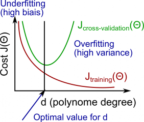
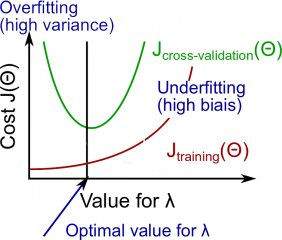
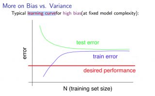
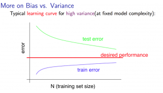

Week 6
======

- Advice for Applying Machine Learning
    - Evaluating a Learning Algorithm
        - Deciding What to Try Next
        - Evaluating a Hypothesis
        - Model Selection and Train/Validation/Test Sets
    - Bias vs. Variance
        - Diagnosing Bias vs. Variance
        - Regularization and Bias/Variance
        - Learning Curves
        - Deciding What to Do Next Revisited
    - Review
        - Quiz: Advice for Applying Machine Learning
        - Assignment: Regularized Linear Regression and Bias/Variance
- Machine Learning System Design
    - Building a Spam Classifier
        - Prioritizing What to Work On
        - Error Analysis
    - Handling Skewed Data
        - Error Metrics for Skewed Classes
        - Trading Off Precision and Recall
    - Using Large Data Sets
        - Data For Machine Learning
    - Review
        - Quiz: Machine Learning System Design

--------------------------------------------------------------------------------

Advice for Applying Machine Learning
====================================

- Evaluating a Learning Algorithm
    - Deciding What to Try Next
    - Evaluating a Hypothesis
    - Model Selection and Train/Validation/Test Sets
- Bias vs. Variance
    - Diagnosing Bias vs. Variance
    - Regularization and Bias/Variance
    - Learning Curves
    - Deciding What to Do Next Revisited
- Review
    - Quiz: Advice for Applying Machine Learning
    - Assignment: Regularized Linear Regression and Bias/Variance

See: https://share.coursera.org/wiki/index.php/ML:Advice_for_Applying_Machine_Learning

\[Evaluating a Learning Algorithm] Deciding What to Try Next
------------------------------------------------------------

Errors in your predictions can be troubleshooted by:

- Getting more training examples
- Trying smaller sets of features
- Trying additional features
- Trying polynomial features
- Increasing or decreasing λ

Don't just pick one of these avenues at random. We'll explore diagnostic techniques for choosing one of the above solutions in the following sections.

\[Evaluating a Learning Algorithm] Evaluating a Hypothesis
----------------------------------------------------------

TODO: TBA

\[Evaluating a Learning Algorithm] Model Selection and Train/Validation/Test Sets
---------------------------------------------------------------------------------

TODO: TBA

\[Bias vs. Variance] Diagnosing Bias vs. Variance
-------------------------------------------------

TODO: TBA



\[Bias vs. Variance] Regularization and Bias/Variance
-----------------------------------------------------

TODO: TBA



\[Bias vs. Variance] Learning Curves
------------------------------------

TODO: TBA





\[Bias vs. Variance] Deciding What to Do Next Revisited
-------------------------------------------------------

Our decision process can be broken down as follows:

- Getting more training examples
    - → Fixes **high variance**
- Trying smaller sets of features
    - → Fixes **high variance**
- Adding features
    - → Fixes **high bias**
- Adding polynomial features
    - → Fixes **high bias**
- Decreasing λ
    - → Fixes **high bias**
- Increasing λ
    - → Fixes **high variance**

### Diagnosing Neural Networks

- A neural network with fewer parameters is **prone to underfitting**. It is also **computationally cheaper**.
- A large neural network with more parameters is **prone to overfitting**. It is also **computationally expensive**. In this case you can use regularization (increase λ) to address the overfitting.

Using a single hidden layer is a good stating default. You can train your neural network on a number of hidden layers using your cross validation set.

TODO: TBA

\[Review] Quiz: Advice for Applying Machine Learning
----------------------------------------------------

TODO: TBA

\[Review] Assignment: Regularized Linear Regression and Bias/Variance
---------------------------------------------------------------------

TODO: TBA

--------------------------------------------------------------------------------

Machine Learning System Design
==============================

- Building a Spam Classifier
    - Prioritizing What to Work On
    - Error Analysis
- Handling Skewed Data
    - Error Metrics for Skewed Classes
    - Trading Off Precision and Recall
- Using Large Data Sets
    - Data For Machine Learning
- Review
    - Quiz: Machine Learning System Design

\[Building a Spam Classifier] Prioritizing What to Work On
----------------------------------------------------------

Different ways we can approach a machine learning problem:

- Collect lots of data (for example "[honeypot](https://en.wikipedia.org/wiki/Honeypot_(computing))" project but doesn't always work)
- Develop sophisticated features (for example: using email header data in spam emails)
- Develop algorithms to process your input in different ways (recognising misspelling in spam).

It is difficult to tell which of the options will be helpful.

\[Building a Spam Classifier] Error Analysis
--------------------------------------------

The recommended approach to solving machine learning problems is:

- Start with a simple algorithm, implement it quickly, and test it early.
- Plot learning curves to decide if more data, more features, etc. will help.
- Error analysis: manually examine the errors on examples in the cross validation set and try to spot a trend.

It's more important to get error results as a single, numerical value. Otherwise it is difficult to assess your algorithm's performance.

You may need to process your input before it is useful. For example, if your input is a set of works, you may want to treat the same word with different forms (fail/failing/failed) as one word, so must use "[stemming](https://en.wikipedia.org/wiki/Stemming)" software (e.g. [Porter stemmer](http://tartarus.org/martin/PorterStemmer/)) to recognise them all as one.

\[Handling Skewed Data] Error Metrics for Skewed Classes
--------------------------------------------------------

It is sometimes difficult to tell whether a reduction in error is actually an improvement of the algorithm.

- For example: In predicting a cancer diagnoses where `0.5`% of the examples have cancer, we find out learning algorithm has a `1`% error. However, if we were to simply classify every single example as a `0`, then our error would reduce to `0.5`% even though we did not improve the algorithm.

This usually happens with **skewed classes**; that is, when our class is very rare in the entire data set.

For this we can use **Precision/Recall**.

- Predicted: `1`, Actual: `1` --- True positive
- Predicted: `0`, Actual: `0` --- True negative
- Predicted: `0`, Actual: `1` --- False negative
- Predicted: `1`, Actual: `0` --- False positive

**Precision**: Of all patient we predicted where y = 1, what fraction actually has cancer?

```
            True Positive                       True Positives
----------------------------------- = --------------------------------
Total number of predicted positives   True Positives + False positives
```

**Recall**: Of all the patient that actually have cancer, what fraction did we correctly detect as having cancer?

```
            True Positive                       True Positives
----------------------------------- = --------------------------------
    Number of actual positives        True Positives + False negatives
```

These two metrics give us a better sense of how our classifier is doing. We want both precision and recall to be high.

In the example at the beginning of the section, if we classify all patients as `0`, then our **recall** will be

```
  0
-----
0 + f
```

, so despite having a lower error percentage, we can quickly see it has worse recall.

Note 1: if an algorithm predicts only negatives like it does in one of exercises, the precision is not defined, it is impossible to decide by `0`. F1 score will not be defined too.

Note 2: a manual calculation of precision and other functions is an error prone process. It is very easy through to create an Excel file for this. Put into it a table `2*2` for all necessary input values, label them like "`TruePositives`", "`FalsePositives`", and on other cells of Exel add formulas like `=SUM(TruePositive, FalsePositive, TrueNegative, FalseNegative)`, label this one `AllExamples`. Then on another cell label `Accuracy` and a formula:
`=SUM(TruePositive,TrueNegative)/AllExamples`. The same with others. After 10 minutes you will have a spreadsheet for all examples and questions. [Snap shot https://share.coursera.org/wiki/index.php/File:Spreadsheetquiz6.GIF]

\[Handling Skewed Data] Trading Off Precision and Recall
--------------------------------------------------------

We might want a **confident** prediction of two classes using logistic regression. One way is to increase our threshold:

- Predict `1` if: h<sub>θ</sub>(x) ≥ `0.7`
- Predict `0` if: h<sub>θ</sub>(x) < `0.7`

This way, we only predict cancer if the patient has a `70`% chance.

Doing this, we will have **higher precision** but **lower recall** (refer to the definitions in the precious section).

In the opposite example, we can lower our threshold:

- Predict `1` if: h<sub>θ</sub>(x) ≥ `0.3`
- Predict `0` if: h<sub>θ</sub>(x) < `0.3`

This way, we get a very **safe** prediciton. This will cause **higher recall** but **lower precision**.

> The greater the threshold, the greater the precision and the lower the recall.

> The lower the threshold, the greater the recall and the lower the precision.

In order to turn these two metrics into one single number, we can take the **F value**.

One way is to take the **average**:


```
P + R
-----
  2
```

This does not work well. If we predict all `y = 0` then that will bring the average up despite having `0` recall. If we predict all examples as `y = 1`, then the very high recall will bring up the average despite having `0` precision.

A better way is to compute the **F Score** (or F<sub>1</sub> score):

```
          2 * P * R
F Score = ---------
            P + R
```

In order for the F Score to be large, both precision and recall must be large.

We want to train precision and recall on the **cross validation set** so as not to bias out test set.

\[Using Large Data Sets] Data For Machine Learning
--------------------------------------------------

How much data should we train on?

In certain cases, and "inferior algorithm," if given enough data, can outperform a superior algorithm with less data.

We must choose our features to have **enough** information. A useful test is: Given input `x`, would a human expert be able to confidently predict `y`?

**Rationale for large data**: if we have **low bias** algorithm (many features or hidden units making a very complex function), then the larger the training set we use, the less we will have overfitting (and the more accurate the algorithm will be on the test set).

\[Review] Quiz: Machine Learning System Design
----------------------------------------------

### Quiz instructions

When the quiz instructions tell you to enter a value to "two decimal digits", what it really means is "two significant digits". So, just for example, the value `0.0123` should be entered as "`0.012`", not "`0.01`".

