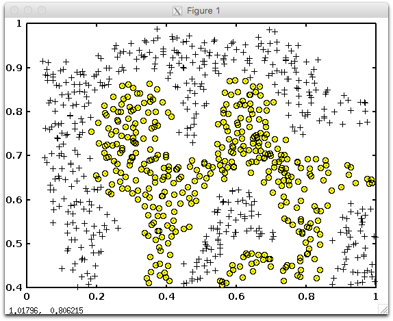
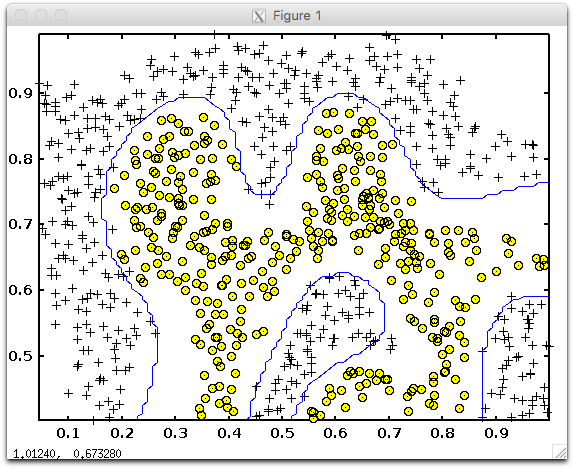

Week 7
======

- Support Vector Machines
    - Large Margin Classification
        - Optimization Objective
        - Large Margin Intuition
        - Mathematics Behind Large Margin Classification
    - Kernels
        - Kernels I
        - Kernels II
    - SVMs in Practice
        - Using An SVM
    - Review
        - Quiz: Support Vector Machines
        - Assignment: Support Vector Machines3h 00m

--------------------------------------------------------------------------------

Support Vector Machines
-----------------------

- Large Margin Classification
    - Optimization Objective
    - Large Margin Intuition
    - Mathematics Behind Large Margin Classification
- Kernels
    - Kernels I
    - Kernels II
- SVMs in Practice
    - Using An SVM
- Review
    - Quiz: Support Vector Machines
    - Assignment: Support Vector Machines3h 00m

\[Large Margin Classification] Optimization Objective
-----------------------------------------------------

TODO: TBA

\[Large Margin Classification] Large Margin Intuition
-----------------------------------------------------

TODO: TBA

\[Large Margin Classification] Mathematics Behind Large Margin Classification
-----------------------------------------------------------------------------

TODO: TBA

\[Kernels] Kernels I
--------------------

TODO: TBA

\[Kernels] Kernels II
---------------------

TODO: TBA

### Choosing SVM Parameters

Choosing *C* (recall that `C = 1/λ`)

- If *C* is large, then we get higher variance/lower bias
- If *C* is small, then we get lower variance/higher bias

The other parameter we must choose is σ<sup>2</sup> from the Gaussian Kernel function:

- With a large σ<sup>2</sup>, the features ƒ<sub><i>i</i></sub> vary more smoothly, causing higher bias and lower variance.
- With a small σ<sup>2</sup>, the features ƒ<sub><i>i</i></sub> vary less smoothly, causing lower bias and higher variance.

\[SVMs in Practice] Using An SVM
--------------------------------

TODO: TBA

\[Review] Quiz: Support Vector Machines
---------------------------------------

TODO: TBA

\[Review] Assignment: Support Vector Machines
---------------------------------------------

### Error in `visualizeBoundary.m`

I encountered an error when Octave is going through the Part 5 of `ex6.m`. Because of this error, the program was terminated halfway through its execution without plotting the decision boundary in the graph loaded the **Example Dataset 2**.

Here is the error message output:

```octave
Training SVM with RBF Kernel (this may take 1 to 2 minutes) ...

Training ......................................................................
...............................................................................
...............................................................................
...............................................................................
...............................................................................
...............................................................................
...................................................... Done!

error: set: unknown hggroup property Color
error: called from
    __contour__ at line 201 column 5
    contour at line 74 column 16
    visualizeBoundary at line 24 column 1
    ex6 at line 109 column 1
>>
```



#### Solution

In [this course discussion thread regarding potential issues when submitting an assignment](https://www.coursera.org/learn/machine-learning/discussions/vgCyrQoMEeWv5yIAC00Eog), a course mentor directed you to another thread teaching you how to fix this error; see [the top voted answer in this separate thread](https://www.coursera.org/learn/machine-learning/discussions/YTIKWMpuEeSWEiIAC0wC5g?sort=upvotesDesc&page=1).

Concretely, to fix the error, change values of the contour function in `visualizeBoundary.m`,

from:

```octave
contour(X1, X2, vals, [0 0], 'Color', 'b');
```

to:

```octave
contour(X1, X2, vals, [1 1], 'b');
```

This one-liner fixes the error and now the decision boundary is successfully plotted as below:


